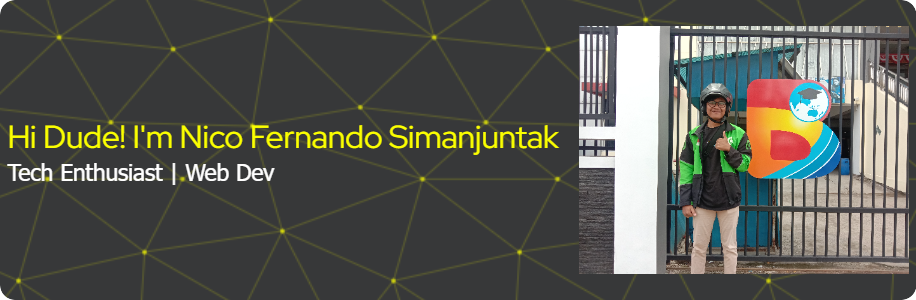
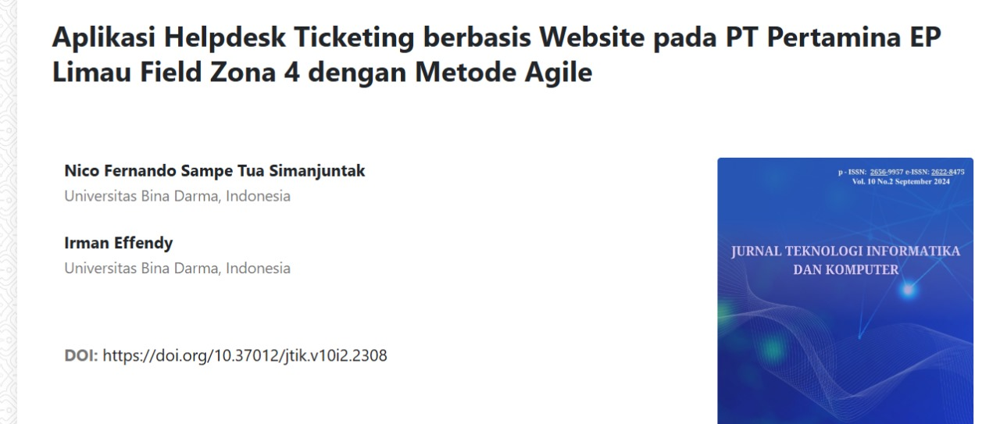

<!--
**nicofernandos/nicofernandos** is a ✨ _special_ ✨ repository because its `README.md` (this file) appears on your GitHub profile.

Here are some ideas to get you started:

- 🔭 I’m currently working on ...
- 🌱 I’m currently learning ...
- 👯 I’m looking to collaborate on ...
- 🤔 I’m looking for help with ...
- 💬 Ask me about ...
- 📫 How to reach me: ...
- 😄 Pronouns: ...
- ⚡ Fun fact: ...
-->

##### 🌐 Socials:

   

##### 💻 Tech Stack:

          

##### 📊 GitHub Stats:

 
 

##### 🔝 Top Contributed Repo

##### Final Project Research and Publication

[Link Paper](https://journal.thamrin.ac.id/index.php/jtik/article/view/2308) 

<h2> Beware Of Snakes </h2>

